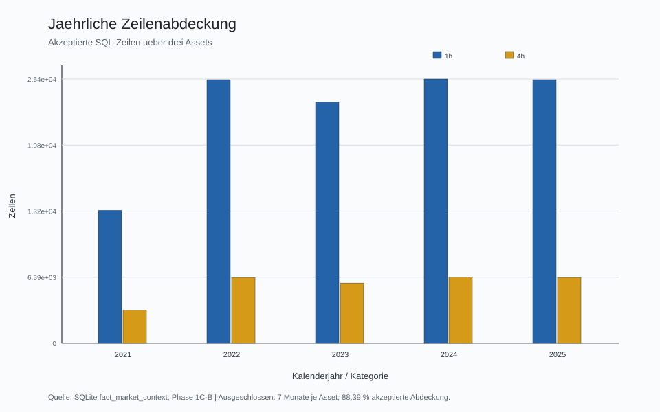
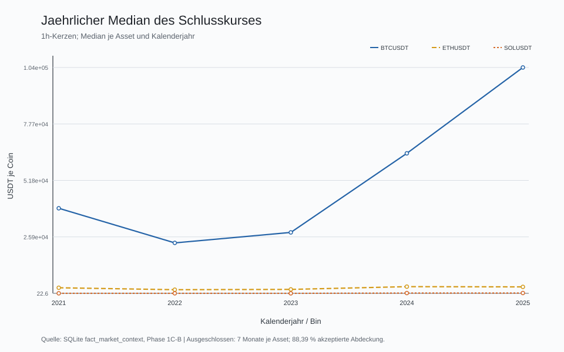
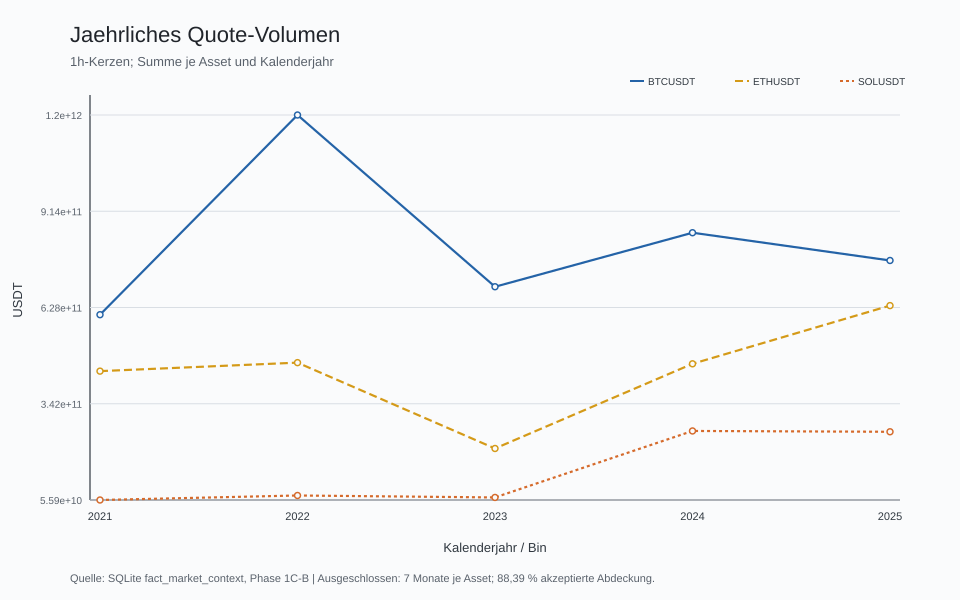
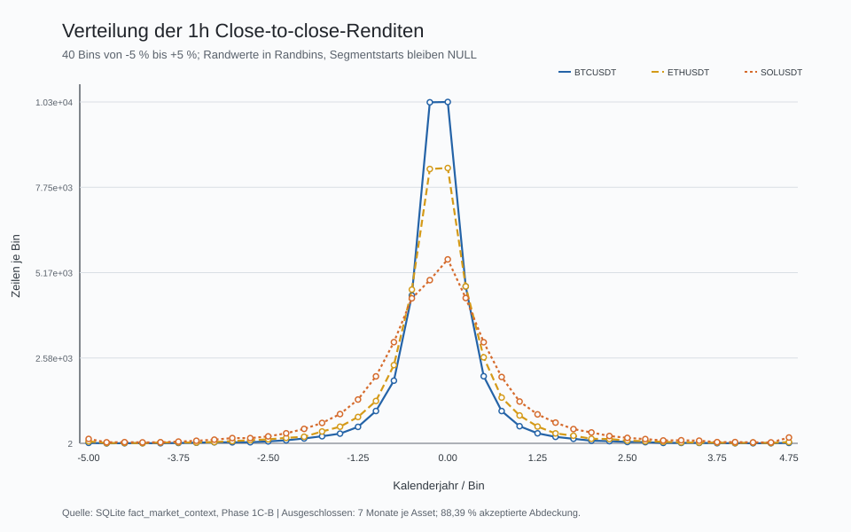
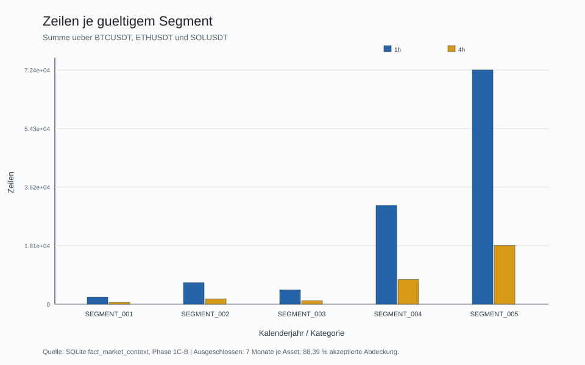
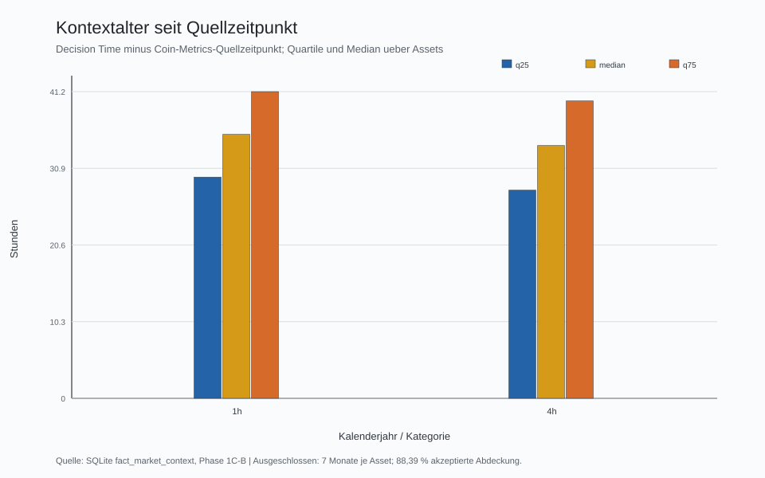

# Phase 1C-C: reproduzierbare deskriptive EDA

## Technische Zusammenfassung

Die EDA basiert ausschliesslich auf der abgenommenen SQLite-Tabelle mit **145.260** Zeilen: **116.208** 1h- und **29.052** 4h-Kerzen. Alle sechs Asset-Zeitrahmen-Gruppen besitzen dieselben fuenf gueltigen Segmente. Zukunftskontext, ausgeschlossene Monate, Primaerschluesselduplikate und verwaiste Fremdschluessel: jeweils **0**. Diese Phase beschreibt Daten; sie bewertet keine Strategie.

## Die Abdeckung ist gross, aber absichtlich nicht lueckenlos

Die akzeptierte zeitliche Abdeckung betraegt **88,39 %**. **11,61 %** beziehungsweise **15.264 Asset-Kalenderstunden** wurden konservativ ausgeschlossen. Davon getrennt ist die tatsaechliche Quellenluecke von nur **42 Asset-Stunden**. Die strengere Monatsregel verhindert, dass spaetere Zeitreihenzustaende ueber unsichere Grenzen fortgesetzt werden.

Die Power-BI-Kalenderdimension zeigt den gesamten Scope lueckenlos mit **1.826 Tagen**. Darin sind **1.614 akzeptierte Tage** und **212 ausgeschlossene Tage** eindeutig markiert. Die ausgeschlossenen Tage bleiben auf Zeitachsen sichtbar, besitzen aber weiterhin keine Faktzeilen.

Die Grafik zeigt ausschliesslich akzeptierte SQL-Zeilen. Unterschiede zwischen Jahren entstehen vor allem durch die sieben vollstaendig ausgeschlossenen Kalendermonate und die unterschiedliche Zahl von Stunden pro Jahr, nicht durch nachtraegliches Auffuellen.

## Preise, Volumen und Aktivitaet unterscheiden sich deutlich nach Asset und Zeitrahmen

Die Preisniveaus sind wegen unterschiedlicher Coin-Einheiten nicht direkt als relative Leistung vergleichbar. Fuer 1h liegt der Median der Kerzenspanne bei BTCUSDT bei **0,6023 %**, bei ETHUSDT bei **0,8211 %** und bei SOLUSDT bei **1,2516 %**. Die robusten Medianwerte sind fuer diese schiefen Verteilungen aussagekraeftiger als alleinige Mittelwerte.

Die Linien zeigen jaehrliche Mediane, keine Rendite- oder Performancebewertung. Unterschiedliche Preisniveaus und Einheiten bleiben sichtbar und werden nicht normalisiert.

Das Quote-Volumen ist in USDT vergleichbar. Die 1h-Summen vermeiden eine Doppelzaehlung zwischen 1h- und den daraus aggregierten 4h-Kerzen. Als robuste Querschnittswerte betragen die Median-Quote-Volumina je 1h-Kerze BTCUSDT **71.459.017,38**, ETHUSDT **37.913.051,39** und SOLUSDT **11.036.339,68** USDT.

## 4h-Kerzen verdichten vier 1h-Kerzen und sind deshalb nicht unabhaengig

Die 4h-Tabelle enthaelt **29.052** Zeilen gegenueber **116.208** 1h-Zeilen. Volumen und Tradeanzahl je 4h-Kerze sind Aggregationen derselben Marktaktivitaet; Vergleiche der Kerzenverteilungen duerfen deshalb nicht als zwei unabhaengige Stichproben interpretiert werden.

Close-to-close-Renditen sind rein deskriptiv und nur bei exakt benachbarten Kerzen desselben Segments berechnet. **30** Werte bleiben NULL, darunter alle **30** Asset-Zeitrahmen-Segmentstarts. Es gibt keine Berechnung ueber eine Segmentgrenze oder Zeitluecke.

## Die fuenf Segmente bleiben methodisch getrennt

Laengere Segmente enthalten erwartungsgemaess mehr Zeilen. Die gemeinsame Assetmaske stellt sicher, dass BTCUSDT, ETHUSDT und SOLUSDT fuer jeden akzeptierten Monat gemeinsam vorhanden sind. Spaetere Indikator- oder Modellzustaende muessen an jedem Segmentstart neu beginnen.

## Coin-Metrics-Kontext ist punkt-in-der-Zeit verfuegbar

Die Kontextverteilung wird auf **1.619 eindeutigen Quellzeitpunkten** ausgewertet, damit dieselbe taegliche BTC-Beobachtung nicht durch drei Assets und intraday Kerzen mehrfach gewichtet wird. Der Median des BTC-Kontextpreises liegt bei **43.888,98 USD**, der Median der aktiven Adressen bei **852.697**.

`context_age_hours` misst `decision_time_utc - context_source_timestamp_utc`: bei 1h **24-47 Stunden**, Median **35.5**; bei 4h **24-44 Stunden**, Median **34**. Das getrennte `context_age_since_d1_hours` misst `decision_time_utc - context_available_from_utc_d1`: 1h **0-23 Stunden**, Median **11.5**; 4h **0-20 Stunden**, Median **10**. Beide Bezugsgrössen bleiben getrennt. D+2 bleibt separat erhalten.

## Scope, Kennzahlen und Vergleichsbasis

Analysiert werden BTCUSDT, ETHUSDT und SOLUSDT von Januar 2021 bis Dezember 2025 in 1h und 4h. Koernung ist eine akzeptierte, vollstaendig geschlossene Kerze. Alle Preis- und Volumenfelder stammen aus Binance Public Data; der Tageskontext stammt aus Coin Metrics und ist mit der konservativen D+1-00:00-UTC-Regel verbunden.

## Methodik und Reproduzierbarkeit

Die Pipeline prueft vor jeder Ausgabe Datenbankhash, unabhaengigen logischen Fingerprint, SQL-Berichtscache, Integritaet, Zeilenzahlen, Matrix, Schluessel, Segmente, Ausschlussmonate und Gate-Status. Danach erzeugt sie CSV und SVG temporaer, prueft Manifeste und Beziehungen und publiziert ohne Ueberschreiben. Ein Wiederanlauf gilt nur bei vollstaendig byteidentischem Cache als `CACHED_VALID`.

## Grenzen und Robustheitspruefungen

- Die Ergebnisse sind deskriptiv; sie beweisen keine Ursache und keine Handelbarkeit.
- Extremwerte bleiben erhalten. Die grafische Renditeverteilung buendelt lediglich Werte ausserhalb +/-5 % in Randbins.
- D+1 00:00 UTC ist eine konservative Annahme und muss spaeter separat gegen D+2 geprueft werden.
- 4h ist aus 1h aggregiert; beide Zeitrahmen sind nicht unabhaengig.
- Vollstaendige Monatsausgrenzung ist strenger als die reale 42-Stunden-Quellenluecke.

## Empfohlener naechster Schritt

Nach unabhaengiger Abnahme koennen diese Exporte in Power BI geladen und Beziehungen, Datentypen, Sortierung, Filterrichtung und Measures gegen den Vertrag geprueft werden. Erst danach darf G1-13 bewertet werden. Eine Signal- oder Backtestphase ist nicht Bestandteil dieses Auftrags.

## Offene Fragen

- Stimmen die geplanten DAX-Measures im spaeteren Power-BI-Modell byte- und filterlogisch mit den EDA-Tabellen ueberein?
- Bleiben Segmentgrenzen in allen spaeteren Zeitreihenberechnungen wirksam?
- Wie stark aendert die spaetere D+2-Sensitivitaet rein deskriptive Kontextzusammenhaenge?
